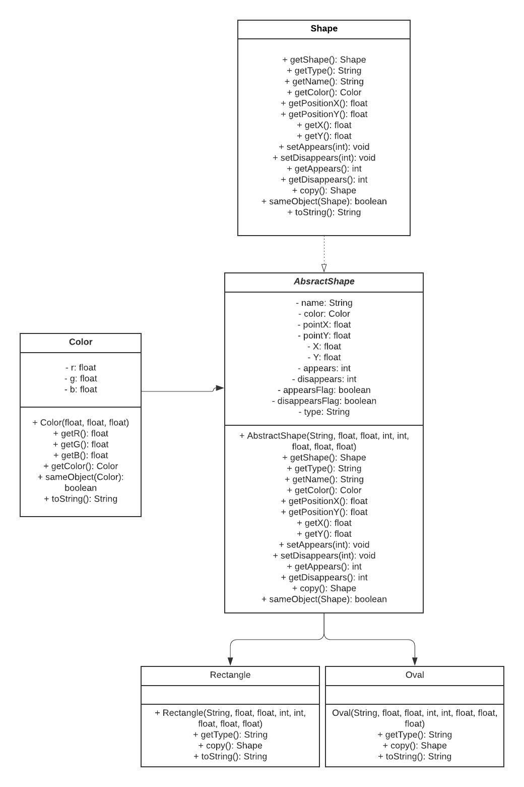

## Easy Animator

## Model Design
### Animation

Our [Animation](/src/cs5004/animator/model/Animation.java) interface represents an animation program. 
It's implemented in the AnimationImpl class as `HashMap<Shape, List<Transformation>>`. 
We chose to use a hashmap so that we had a clear connection between our shapes and the different 
transformation that would be applied to the them in during the program. Our implementation of the 
list ensures that we don't have overlapping transformations of the same type being applied to the 
same shape object. 


Our [AnimationImpl](/src/cs5004/animator/model/AnimationImpl.java) has methods to handle tasks such 
as adding new shapes/transformation to the animation or removing shapes/transformation from the the 
animation. 

### Transformation

Our [Transformation](/src/cs5004/animator/model/Transformation.java) interface represents the methods 
implemented by our different transformations. Our interface is implemented in an abstract class to 
minimiz code repetiotion in each other the subclasses. We created a [Move](/src/cs5004/animator/model/Move.java) 
class that stores the information to change the shape's position on the screen, a [Scale](/src/cs5004/animator/model/Scale.java) 
class that stores the information to change the width/length (or X-radius and Y-radius) of our 
shapes, and a [ChangeColor](/src/cs5004/animator/model/ChangeColor.java) class that stores the 
information to change the shape's color. Each of these classes take in a start and end time for 
each transformation. 


### Shape

Our [Shape](/src/cs5004/animator/model/Shape.java) interface is implemented as an abstract class that 
minimizes code repetition. All common code and methods shared by the [Oval](/src/cs5004/animator/model/Oval.java) 
and [Rectangle](/src/cs5004/animator/model/Rectangle.java) subclasses are implemented here. Our Shapes interface 
and its classes are used in the [AnimationImpl](/src/cs5004/animator/model/AnimationImpl.java) as 
the key for our HashMap.

To represent the color of our shape, we created a [Color](/src/cs5004/animator/model/Color.java) 
class that takes in the Red, Green and Blue values provided as inputs to the AbstractShape 
constructor and creates a new Color object.



## UML Class Diagram


### Modified UML Class Diagram
These are some of the changes we made to our model design as we worked through our views. 

### Shape
#### Shape Constructors
Because the properties for particular shape and its name and type are set at different times in the
[AnimationBuilder](/src/cs5004/animator/util/AnimationBuilder.java), we had to change our
constructor for our shapes. Our constructor now takes in two argument, name and type. A seperate
methods was added to set the other properties for the shape.

*TODO* Upload new UML diagrams with color-coding to show where changes were made

#### Shape Arguments
We also changed our shapes to accept arguments of type int instead of float, again, to adhere to the
methodsas defined in the [AnimationBuilder](/src/cs5004/animator/util/AnimationBuilder.java) 
interface. In order to output a correctly formated string representation where needed, the 
DecimalFomart class is used.

*TODO* Upload new UML diagrams with color-coding to show where changes were made

### Transformation

We felt the need to know a shape's state before applying a new transformation, so a new HashMap 
field was created to store this information. Additionaly, new methods were added to set and get the
initial property for each transformation, with this informatio being read from the files. To make 
these changes, we added 8 new methods to our [Transformation](/src/cs5004/animator/model/Transformation.java) 
interface and three new fields to each sub-class as shown below.

*TODO* Upload new UML diagrams with color-coding to show where changes were made

### Animation

New fields were added to store information about the canvas for the animation. This information 
is read from a file and a method was created to set (and corresponding getters) this information. 
We made changes to some of our method signatures (as indicated below in the UML diagram) to make 
everything work well with the [AnimationBuilder](/src/cs5004/animator/util/AnimationBuilder.java) and
files being read in.

*TODO* Upload new UML diagrams with color-coding to show where changes were made


## View Design
We implemented three views, a [Text](/src/cs5004/animator/view/TextView.java), [SVG](/src/cs5004/animator/view/SVGView.java), 
and [Visual](/src/cs5004/animator/view/GraphicView.java) views. We first by defining and implementing
a [View](/src/cs5004/animator/view/View.java) interface that has methods for reading inputs from the
CLI, extracting useful information (in file, out file, view and speed) and passing that information
to our ```animate()``` method that then displays the output of the veiw. From our main class,
[EasyAnimator](/src/cs5004/animator/EasyAnimator.java), we call each respectful view based on what
is read from the CLI. To store our view, we uses an abstract [ViewFactory](/src/cs5004/animator/view/ViewFactory.java)
the creates the view from this input. 

Our ```animate()``` is implemented in each view. Additional private methods were created to aid in 
the implementation of the views. 

### Graphic View

## Controller Design