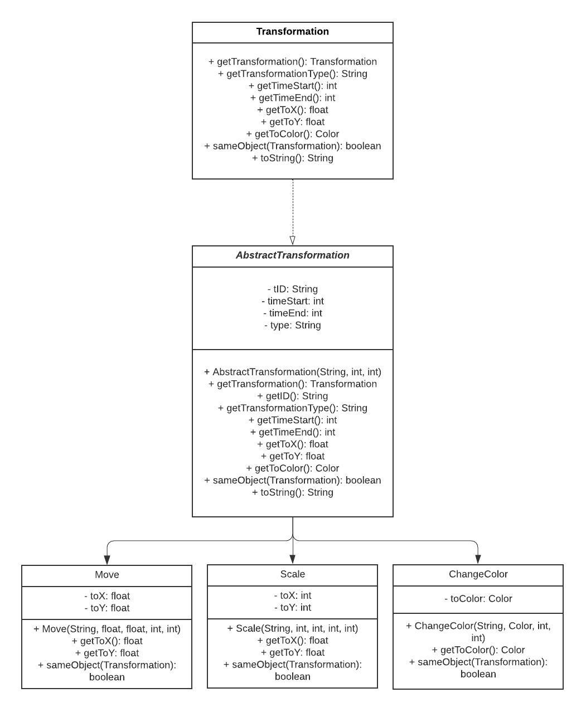

## Easy Animator

### Animation

Our [Animation](/src/animation/Animation.java) interface represents an animation program. It's implemented in the AnimationImpl class as `HashMap<Shape, List<Transformation>>`. 
We chose to use a hashmap so that we had a clear connection between our shapes and the different transformation that would
be applied to the them in during the program. Our implementation of the list ensures that we don't have overlapping transformations of the same type being applied to the same shape object. 

Our [AnimationImpl](/src/animation/AnimationImpl.java) has methods to handle tasks such as adding new shapes/transformation to the animation or removing shapes/transformation from the the animation. 

### Transformation

Our [Transformation](/src/animation/Transformation.java) interface represents the methods implemented by our different transformations. Our interface is implemented in an abstract class to minimiz code repetiotion in each other the subclasses.
We created a [Move](/src/animation/Move.java) class that stores the information to change the shape's position on the screen, a [Scale](/src/animation/Scale.java) class that stores the information to change the width/length (or X-radius and Y-radius) 
of our shapes, and a [ChangeColor](/src/animation/ChangeColor.java) class that stores the information to change the shape's color. Each of these classes take in a start and end time for each transformation. 

### Shape

Our [Shape](/src/animation/Shape.java) interface is implemented as an abstract class that minimizes code repetition. All common code and methods shared by the [Oval](/src/animation/Oval.java) and [Rectangle](/src/animation/Rectangle.java) subclasses are implemented here. 
Our Shapes interface and its classes are used in the [AnimationImpl](/src/animation/AnimationImpl.java) as the key for our HashMap.

To represent the color of our shape, we created a [Color](/src/animation/Color.java) class that takes in the Red, Green and Blue
values provided as inputs to the AbstractShape constructor and creates a new Color object.

## UML Diagram

