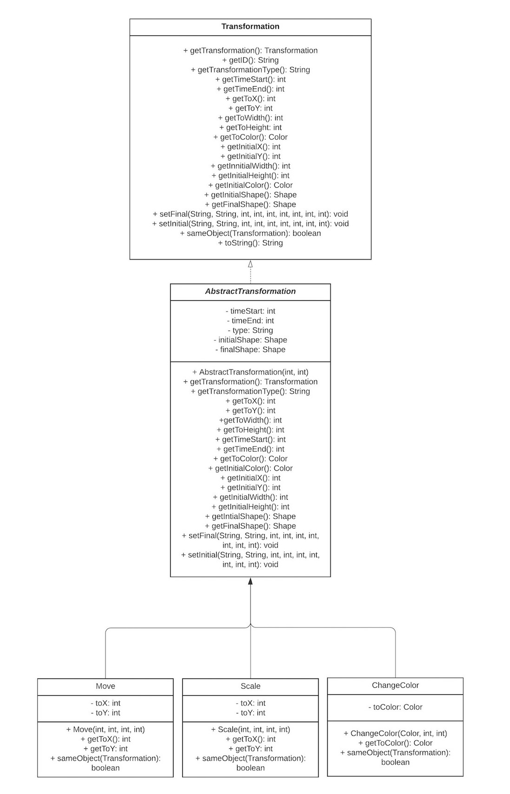
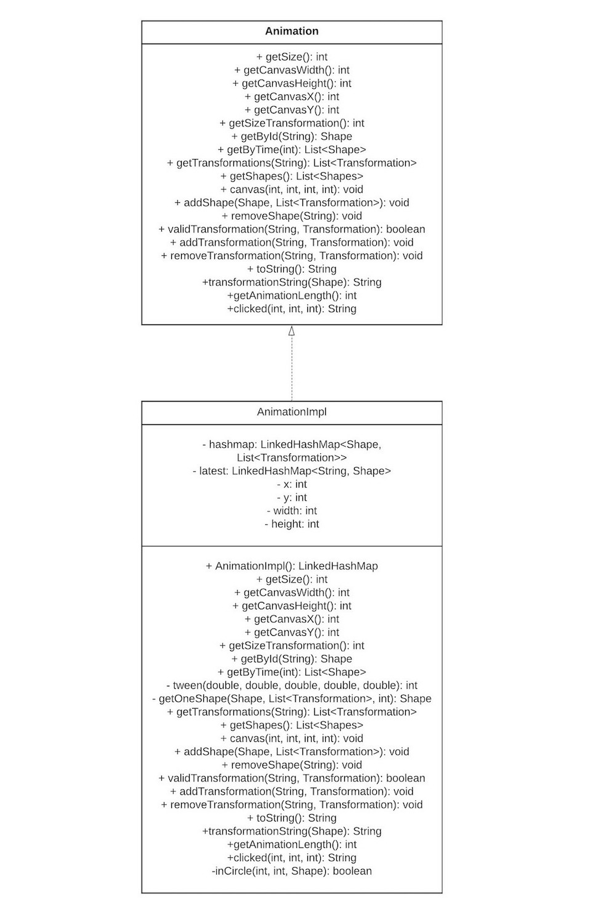
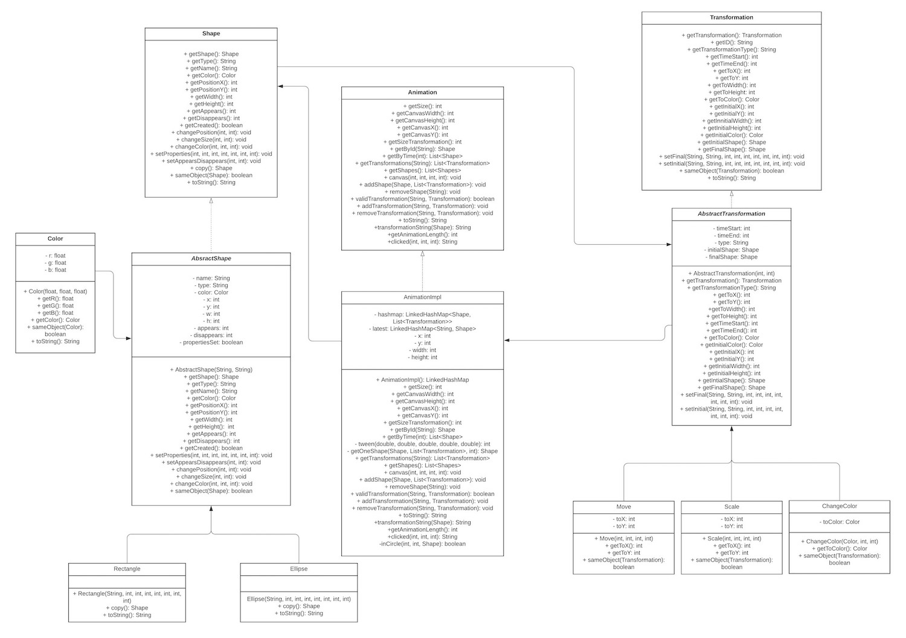

## Easy Animator

## Model Design
### Animation

Our [Animation](../src/cs5004/animator/model/Animation.java) interface represents an animation program.
It's implemented in the AnimationImpl class as `HashMap<Shape, List<Transformation>>`.
We chose to use a hashmap so that we had a clear connection between our shapes and the different
transformation that would be applied to them in during the program. Our implementation of the
list ensures that we don't have overlapping transformations of the same type being applied to the
same shape object.


Our [AnimationImpl](../src/cs5004/animator/model/AnimationImpl.java) has methods to handle tasks such
as adding new shapes/transformation to the animation or removing shapes/transformation from the the
animation.

### Transformation

Our [Transformation](../src/cs5004/animator/model/Transformation.java) interface represents the methods
implemented by our different transformations. Our interface is implemented in an abstract class to
minimize code repetition in each other the subclasses. We created a [Move](../src/cs5004/animator/model/Move.java)
class that stores the information to change the shape's position on the screen, a [Scale](../src/cs5004/animator/model/Scale.java)
class that stores the information to change the width/length (or X-radius and Y-radius) of our
shapes, and a [ChangeColor](../src/cs5004/animator/model/ChangeColor.java) class that stores the
information to change the shape's color. Each of these classes take in a start and end time for
each transformation.


### Shape

Our [Shape](../src/cs5004/animator/model/Shape.java) interface is implemented as an abstract class that
minimizes code repetition. All common code and methods shared by the [Oval](../src/cs5004/animator/model/Oval.java)
and [Rectangle](../src/cs5004/animator/model/Rectangle.java) subclasses are implemented here. Our Shapes interface
and its classes are used in the [AnimationImpl](../src/cs5004/animator/model/AnimationImpl.java) as
the key for our HashMap.

To represent the color of our shape, we created a [Color](../src/cs5004/animator/model/Color.java)
class that takes in the Red, Green and Blue values provided as inputs to the AbstractShape
constructor and creates a new Color object.


## UML Class Diagram


### Modified UML Class Diagram
These are the changes we made to our model design as we worked through our views.

### Shape
#### Shape Constructors
Because the properties for particular shape and its name and type are set at different times in the
[AnimationBuilder](../src/cs5004/animator/util/AnimationBuilder.java), we had to change our
constructor for our shapes. Our constructor now takes in two argument, name and type. A seperate
methods was added to set the other properties for the shape. We also encountered a problem with how
we were initially checking our appears and disappears time to make sure they made sense. To solve this
problem, we combined our setter method for these time so that we're comparing both times as they are
added at the same time.

We also added a new method that would indicate if a shape is created so a new shape of the same properties
is not created. Additionally, we added three new methods for changing the position, size and color
of a copy of the Shape object when a new transformation is created.

#### Shape Arguments
We also changed our shapes to accept arguments of type int instead of float, again, to adhere to the
methodsas defined in the [AnimationBuilder](../src/cs5004/animator/util/AnimationBuilder.java)
interface. In order to output a correctly formated string representation where needed, the
DecimalFomart class is used.


### Transformation

We felt the need to know a shape's state before and after applying a new transformation, so new fields
to store these shapes was added to out Transformation objects. Additionally, new methods were added to get
these initial properties, with this information being read from the files when each shape/transformation
is created. To make these changes, we added 9 new methods to our [Transformation](../src/cs5004/animator/model/Transformation.java)
interface and two new fields to each sub-class as shown below.



### Animation

New fields were added to store information about the canvas for the animation. This information
is read from a file and a method was created to set (and corresponding getters) this information.
We made changes to some of our method signatures (as indicated below in the UML diagram) to make
everything work well with the [AnimationBuilder](../src/cs5004/animator/util/AnimationBuilder.java) and
files being read in.

Two private methods were added to aid with our ```getByTime(int t)``` method, a method to perform the
tweening and another to generate the shape from the tweening results.



### Updated UML Diagram



## View Design
We implemented three views, a [Text](../src/cs5004/animator/view/TextView.java), [SVG](../src/cs5004/animator/view/SVGView.java),
and [Visual](../src/cs5004/animator/view/GraphicView.java) views. We first started by defining and implementing
a [View](../src/cs5004/animator/view/View.java) interface that has methods for reading inputs from the
CLI, extracting useful information (in file, out file, view and speed) and passing that information
to our ```animate()``` method that then displays the output of each view. From our main class,
[EasyAnimator](../src/cs5004/animator/EasyAnimator.java), we call each respectful view based on what
is read from the CLI. To store our view, we uses an abstract factory, [ViewFactory](../src/cs5004/animator/view/ViewFactory.java)
that creates the view from this input.

Our ```animate()``` is implemented in each view. Additional private methods were created to aid in
the implementation of the views.

In the [Text](../src/cs5004/animator/view/TextView.java) view, if a ```-out``` argument is provided,
a .txt file will be generated to store the information.

### Graphic View

Our [Visual](../src/cs5004/animator/view/GraphicView.java) uses a JFrame with our animation taking
place in a JPanel, [GraphicPanel](../src/cs5004/animator/view/GraphicPanel.java), component.
The [GraphicView](../src/cs5004/animator/view/GraphicView.java) frame passes infromation from our file to the panel as
a list of shapes at time 0 to start of the animation, as well as our whole model for further updates.
To ensure that the full animation is shown at each time, our GraphicPanel inherits the dimensions of
the frame (which uses a BorderLayout). This ensures that the dimension of the canvas and preserved when
the window is minimized, maximized, or when it's resized. Additionally a JScrollPane was added to the
frame to allow for scrolling if the animation is able to be fully displayed on the canvas.

Our GraphicPanel updates the canvas at every increment of time, with a thread added to set a delay
before each new display of shapes on the canvas. The shape to be displayed is a list of shapes generated
from our ```getByTime(int t)``` method.

## Changes to the Model (Assignment 8)

For the Model, we did not implement any major changes to the existing structure of our model. The
only change that we did make to our model was adding the ability to get the length of the animation
and a method to return the name of a clicked shape within [AnimationImpl](../src/cs5004/animator/model/AnimationImpl.java).

## Changes to the View (Assignment 8)

For Assignment 8, our view implementations didn't change much for the
[Text](../src/cs5004/animator/view/TextView.java) view or for the
[SVG](../src/cs5004/animator/view/SVGView.java) view. The only real change was adding functionality
for the Text and SVG views to exit the view, as well as creating an out file if given one in the
commands from the user for the Text view and changing some visibility settings in the SVG view.
We did make some bigger changes to our [GraphicView](../src/cs5004/animator/view/GraphicView.java),
as well as adding a whole new [PlaybackView](../src/cs5004/animator/view/PlaybackView.java).
Please see below for more information about the changes and addition for our Graphic and Playback
views.


### Graphic View

The most notable changes to our [GraphicView](../src/cs5004/animator/view/GraphicView.java) is
with the ```animate(Animation m, HashMap<String, String> in)``` method. There was also an additional
private class called ```AnimateAction``` which implements an ```ActionListener```. Within the
animate method in the Graphic view, we switched the timer from a Java timer to a Java Swing timer.
We decided to make this change to add more cohesion between our timers throughout the rest of our program.
This helped with functionality with increasing and decreasing the speed of an animation based on
user input.

### Playback View

Our [PlaybackView](../src/cs5004/animator/view/PlaybackView.java) itself uses a JFrame, JButton,
JPanel, and JLabel to set up the visual layout and functionality for the user slow down, speed up,
loop, rewind, or play and pause action within the Playback view. We also make use of
JFileChooser to allow the user to save their animation and/or upload an animation to the playback view for viewing.

## Controller Design (Assignment 8)

We created a [Controller](../src/cs5004/animator/controller/Controller.java) interface which is
then implemented in the [ViewController](../src/cs5004/animator/controller/ViewController.java)
class. We also added [ButtonEvents](../src/cs5004/animator/controller/ButtonEvents.java) and
[MouseEvents](../src/cs5004/animator/view/MouseEventListener.java) classes. These classes help to
implement functionality that are called when a user triggers a button event to increase/decrease
loop, rewind, and play/pause, save/upload a file and delete a shape from the animation.
